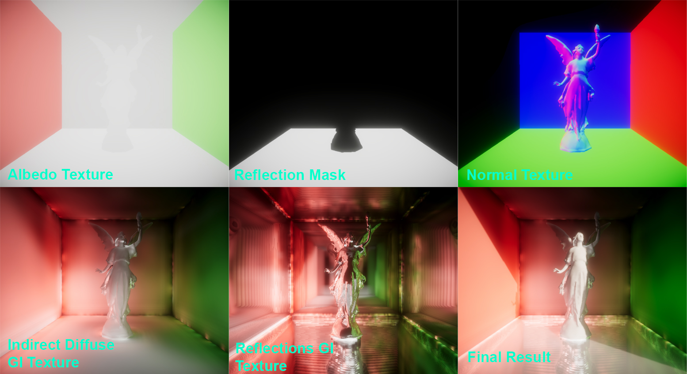

# Sonic Ether Global Illumination URP (SEGI but for URP)

SEGI URP is a fully dynamic global illumination which includes both indirect diffuse gi and reflections. SEGI URP utilize voxel based approach with cone tracing therefore producing noise-free global illumination and also does not need to rely on temporal denoiser. Please watch the video guide for better understanding on the installation process. This project is a hobby project and due to very limited free time available, we are not always online all the time to help with fixing issues.

<h2>Features</h2>
<ol>
  <li>World Space Indirect Diffuse GI through Voxel Cone Tracing.</li>
  <li>World Space Specular Reflections through Voxel Cone Tracing.</li>
  <li>Supports both static and dynamic objects (particle systems too).</li>
  <li>Supports directional light and emissive lights / meshes.</li>
  <li>Does not require RTX hardware.</li>
  <li>Supports Forward, Forward+, and Deferred Rendering.</li>
</ol>

<h2>Limitations</h2>
<ol>
  <li>Only supports URP (Universal Render Pipeline).</li>
  <li>Render Graph is not yet supported (Needs to enable compatibility mode).</li>
  <li>Does not support point lights, spot lights, area lights. (Please use emissive meshes instead).</li>
  <li>Does not support mobile.</li>
  <li>Not beginner-friendly.</li>
  <li>Light Leaking in some areas.</li>
</ol>

<h2>Breakdown Summary</h2>

SEGI URP use the following process. Firstly, external cameras are deployed to render voxels and voxel shadow map. To support forward/forward+ rendering, we added a custom renderer feature which grabs the required gbuffers (e.g. albedo, specular, etc). Next, to keep things simple, a fullscreen shader is used to trace the voxel and compute both reflections and indirect diffuse gi. This process is often done in separate passes, however for simplicity, we combined them in one fullscreen shadergraph. Temporal and Spatial denoiser can be used if we add random sampling, however we already get good results without the need of denoisers. We aimed to make things more user-friendly but in the end it actually makes it more complex and very very confusing. Below are some screenshots of various textures / buffers / whatever you want to call them which contributes to the final result of the global illumination.

<h2>Credits</h2>
- https://github.com/sonicether/SEGI
